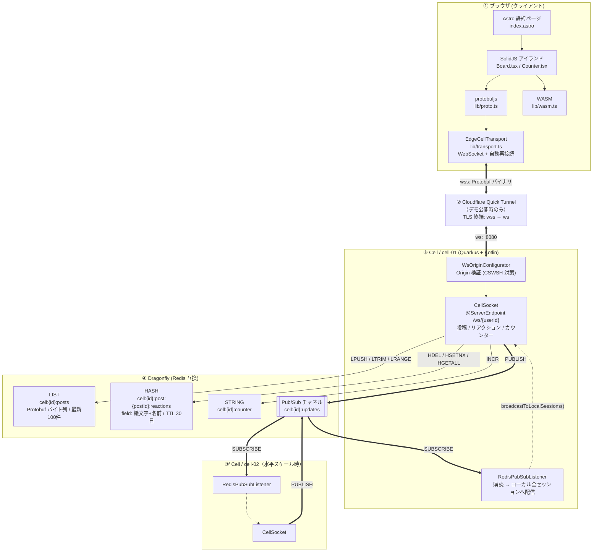
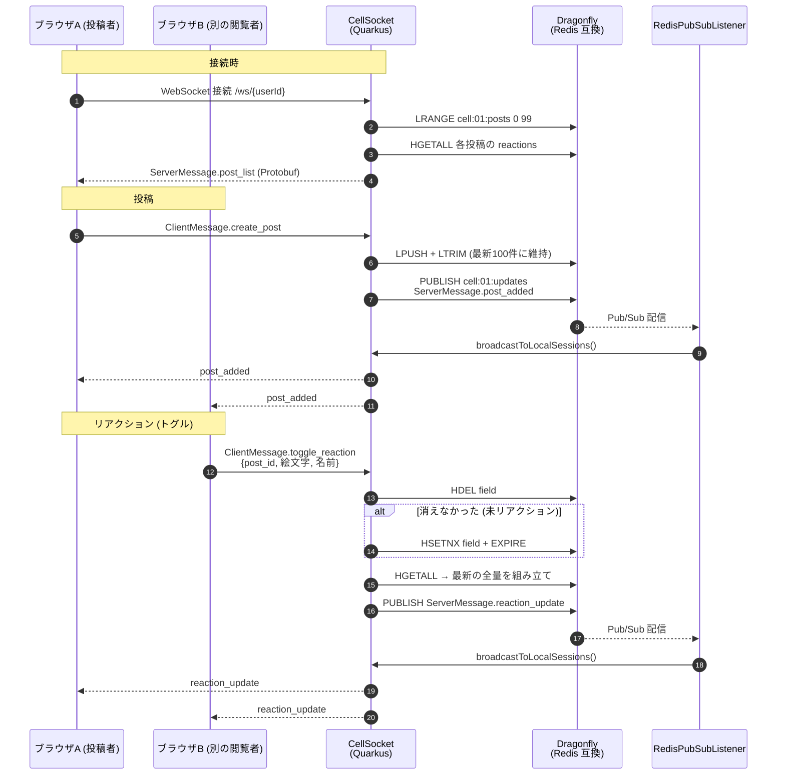

# devin-demo

Devin をデモするためのベースプロジェクトです。
[edge-cell-core](https://github.com/Motoyuki-Oya/edge-cell-core) のアーキテクチャ（Quarkus + Kotlin / Astro + SolidJS + WASM / Dragonfly(Redis互換)）**そのままの技術スタック**で、投稿がリアルタイムに全員へ配信される**簡易掲示板**を実装しています。edge-cell-core を別途クローンしなくても、このリポジトリ単体で動作します。

- **バックエンド**: Quarkus 3.31 + Kotlin（WebSocket / Redis client / Protobuf）
- **フロントエンド**: Astro + SolidJS + WebAssembly
- **リアルタイム層**: Dragonfly（Redis 互換、docker compose 同梱）
- **配信方式**: 投稿を Redis List に永続化し、Redis Pub/Sub で全 Cell のクライアントへブロードキャスト

## 必要環境

- **Java 25**（GraalVM/Temurin など。`backend/build.gradle` が Java 25 前提）
- **Node.js 20+**
- **Docker**（Dragonfly / Redis を起動）

## 起動手順

3 つのプロセスを起動します。

### 1. Dragonfly（Redis互換）

```sh
docker compose -f infra/docker-compose.yml up -d dragonfly
```

### 2. バックエンド（Quarkus, ポート 8080 / WSS 8443）

```sh
cd backend
./gradlew quarkusDev
```

初回はローカル用の自己署名証明書で `https://localhost:8443` を提供します（ブラウザで一度証明書を許可してください）。

### 3. フロントエンド（Astro, ポート 4321）

```sh
cd frontend
npm install
npm run dev
```

ブラウザで http://localhost:4321 を開くと掲示板が表示されます。

### バックエンド接続先の変更（別ホスト / トンネル経由）

フロントエンドの接続先は既定で `https://localhost:8443` です。別ホストやトンネル（Cloudflare Tunnel 等）越しに公開する場合は `PUBLIC_BACKEND_URL` を指定します。

```sh
cd frontend
PUBLIC_BACKEND_URL=https://example.trycloudflare.com npm run dev   # dev
PUBLIC_BACKEND_URL=https://example.trycloudflare.com npm run build # build 時に埋め込まれる
```

`https://` は `wss://`、`http://` は `ws://` に自動変換されます。バックエンド側は WebSocket の Origin 許可リストに公開元のオリジンを追加してください。

```sh
EDGECELL_ALLOWED_ORIGINS=https://frontend.example.trycloudflare.com ./gradlew quarkusDev
```

## アーキテクチャ



ポイント:

- **状態は Cell に持たない**。投稿・リアクションは Dragonfly に集約し、Cell は WebSocket の口だけを持つステートレスな存在。だから Cell を増やしても整合性が壊れない。
- **配信は Pub/Sub 経由**。自分のセッションへ直接送るのではなく、必ず `cell:{id}:updates` に PUBLISH して購読側で配る。これにより**別 Cell につながっているクライアントにも同じ更新が届く**。
- **ブラウザ ⇄ Cell は Protobuf バイナリ**。JSON ではなく `messages.proto` で定義したスキーマをそのまま流す。
- **② のトンネルはデモ公開時だけの経路**。ローカル開発では `wss://localhost:8443` に直接つなぐ。

## 掲示板の仕組み（メッセージの流れ）



- 投稿の送受信は Protobuf（`*/proto/messages.proto`）でシリアライズ。
- 空名は「名無しさん」に、本文は最大 500 文字・投稿は最新 100 件保持。
- リアクションは**認証がないため名前を識別子**として扱い、同じ名前で同じ絵文字を再送すると解除される（トグル）。ハッシュのフィールドを `絵文字 + 名前` にすることで、付け外しが単一フィールドの追加/削除になり同時操作で更新が失われない。

## ディレクトリ構成

```
devin-demo/
├── backend/            # Quarkus + Kotlin（CellSocket.kt が掲示板ロジック）
│   └── src/main/proto/messages.proto
├── frontend/           # Astro + SolidJS + WASM（components/Board.tsx が掲示板UI）
├── infra/              # Dragonfly(Redis) docker compose 等
├── edge/               # Cloudflare Workers ルータ（Sticky ルーティングのスタブ、任意）
├── load-tests/         # 負荷試験用（任意）
├── Architecture.md     # アーキテクチャ解説
└── REQUIREMENTS.md     # 要件定義
```

## 拡張のヒント

- **投稿の永続化強化**: 現状 Redis List（揮発しうる）。Aurora 等の RDB 書き込みを追加できる（REQUIREMENTS.md 参照）。
- **削除・編集等**: `messages.proto` にメッセージを追加し、`CellSocket.kt` と `Board.tsx` を拡張。リアクション機能がこの手順の実例。
  なお `messages.proto` は backend / `frontend/proto` / `frontend/public/proto` の 3 箇所に複製されているため、変更時は 3 つとも更新すること。
- **マルチCell / エッジルーティング**: `edge/router` の Sticky ルーティングを実配線する。

> 掲示板機能を追加した際の差分は edge-cell-core の PR も参照:
> https://github.com/Motoyuki-Oya/edge-cell-core/pull/2
